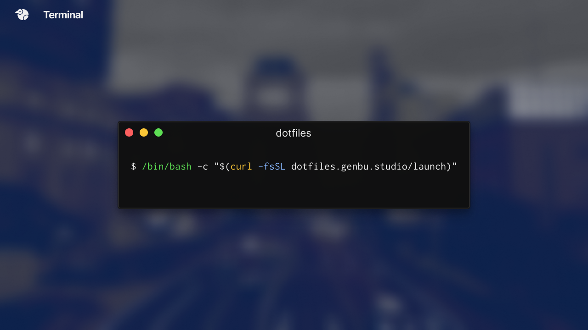

<div align="center">
  <p></p>
  <p>コマンド1つで、環境ができあがり。</p>
  <p>
    
    
    
  </p>
</div>

## インストール方法
```shell
$ curl -L dotfiles.genbu.studio/$(uname) | bash
```

## 動作環境

### macOS
- macOS 10.15

### Linux
- Debian GNU/Linux 10 Buster
- Ubuntu 20.04 LTS


## 対応するソフトウェア

### 🌍ネットワーク
- Tailscale

### 🎨デザインツール
- Adobe Illustrator
- Adobe Photoshop
- Adobe XD
- Blender
- Figma

### 🛠開発ツール
- Docker
- Hyper
- Visual Studio Code

### 📝タスク管理
- Notion

### 👥コミュニケーション
- Discord
- LINE

